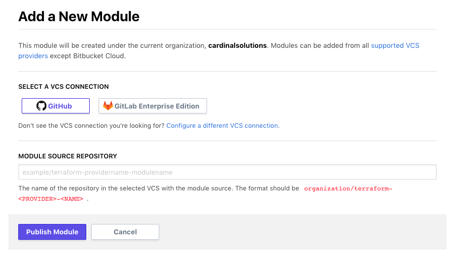

# 09 - Private Module Registry with Terraform Enterprise

## Expected Outcome

In this challenge you will register some modules with your Private Module Registry then reference them in a workspace.

## How to:

### Fork the Module Repositories

Just like in the last challenge, you are going to fork the following repos into your own GitHub account:

- https://github.com/azure-terraform-workshop/terraform-azurerm-networking.git
- https://github.com/azure-terraform-workshop/terraform-azurerm-webserver.git
- https://github.com/azure-terraform-workshop/terraform-azurerm-appserver.git
- https://github.com/azure-terraform-workshop/terraform-azurerm-dataserver.git

Each of these repositories represents a module that can be developed and versioned independently.

### Add Modules

Navigate back to Terraform Enterprise and click the "Modules" menu at the top of the page. From there click the "+ Add Module" button.


You are now ready to add your modules.



Enter the name of the source repository you forked in the previous step. For example: 'YOUR_GITHUB_USERNAME/terraform-azurerm-networking`.

Click "Publish Module".

This will query the repository for necessary files and tags used for versioning.

Congrats, you are done!

Ok, not really...

Repeat this step for the other three modules:

- terraform-azurerm-appserver
- terraform-azurerm-dataserver
- terraform-azurerm-webserver

### Consume Modules

Create a new workspace just like in the previous Challenge, except this time enter the working directory of "app-dev-modules" that will reference your the modules you just added.


### Configure Variables

Set the Terraform Variables:

- 'name' - A unique environment name such as `devmodules`
- 'location' - An Azure region such as `eastus` or `centralus`
- 'username' (sensitive) - A username for the VM's
> Note: this can not be "admin"
- 'password' (sensitive) - A password for the VM's
> NOTE: password must be between 6-72 characters long and must satisfy at least 3 of password complexity requirements from the following:
> 1. Contains an uppercase character
> 2. Contains a lowercase character
> 3. Contains a numeric digit
> 4. Contains a special character
- 'vnet_address_spacing' (HCL) - The Vnet Address space
    ```hcl
    ["10.0.0.0/16"]
    ```
- 'subnet_address_prefixes' (HCL) - The Subnet Address spaces representing 3 subnets
    ```hcl
    [
    "10.0.0.0/24",
    "10.0.1.0/24",
    "10.0.2.0/24",
    ]
    ```

Set Environment Variables for your Azure Service Principal (be sure check the 'sensitive' checkbox to hide these values):

- ARM_TENANT_ID
- ARM_SUBSCRIPTION_ID
- ARM_CLIENT_ID
- ARM_CLIENT_SECRET

### Run a Plan

Click the "Queue Plan" button.


Wait for the Plan to complete.

### Fix the Errors

The `/app-dev-modules/main.tf` file references the wrong modules source. Update all the modules sources (in your forked `azureworkshop-workspaces` GitHub repo) to match your Terraform Enterprise Organization.

For example:

Change this:

```hcl
module "networking" {
  source  = "app.terraform.io/cardinalsolutions/networking/azurerm"
  version = "0.0.1"
...
}
```

To something like this:
```hcl
module "networking" {
  source  = "app.terraform.io/YOUR_TFE_ORGANIZATION/networking/azurerm"
  version = "0.0.1"
...
}
```

Queue a new Plan.

### Apply the Plan

Approve the plan and apply it.

Watch the apply progress and complete.

Login to the at Azure Portal to see your infrastructure.

### Update a Module

In the `azureworkshop-workspaces` repository, navigate to the `app-dev-modules/main.tf` file and update one (or several) of the modules versions from "0.0.1" to "0.0.2".

Commit your change and see what the changes show in the plan. What was the difference between version 0.0.1 and 0.0.2? Does this look like a safe change to make?

## Advanced areas to explore

1. Add another workspace using a different combination of the 3-tier application.
1. Make a change to one of the modules and commit that to the repository. How do you get a new version to show in your Private Module Registry?

## Resources

- [Private Registries](https://www.terraform.io/docs/registry/private.html)
- [Publishing Modules](https://www.terraform.io/docs/registry/modules/publish.html)